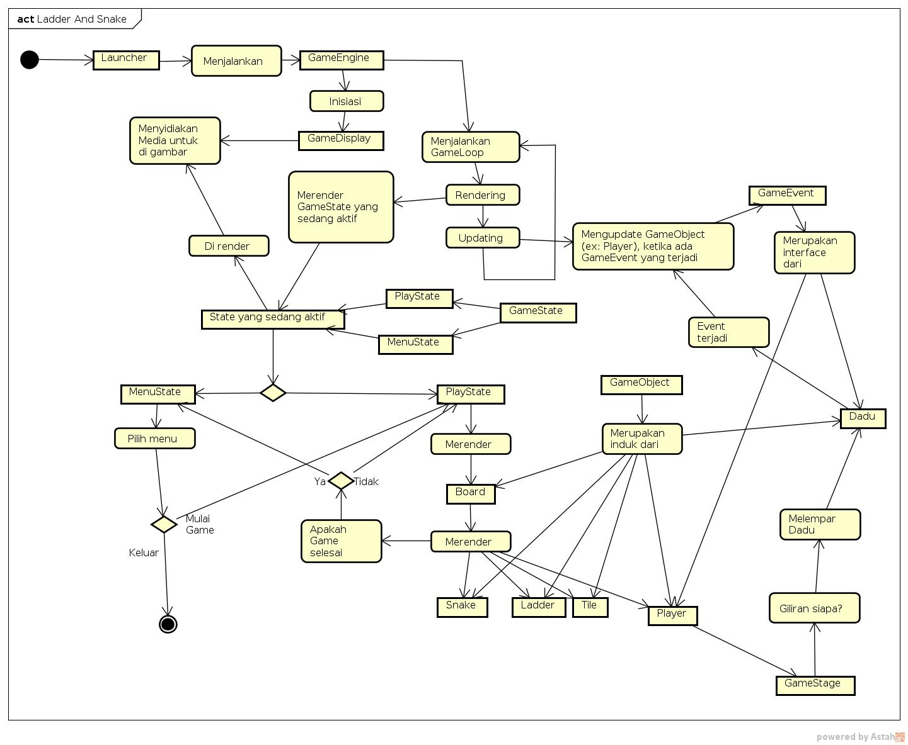

# Snake And Ladder Scala Team A 

## Untuk Kontributor

Ini kelas-kelas yang sudah ada:

* Kelas GameCanvas: Display untuk game, menggunakan kelas _Canvas_ dan _JFrame_
* Kelas GameEngine: Isinya: GameLoop untuk pengaturan FPS, Mekanisme rendering dan update
* Kelas GameObject: Semua benda didalam game merupakan turunan dari kelas ini
* Kelas Tile: Representasi dari kotak-kotak didalam papan permainan
* Kelas Board: Representasi dari papan permainan, mempopulasi tile-tile yang dibutuhkan untuk membuat papan permainan
* Object Launcher: Kelas Tester

### Diagram Program

### Mekanisme

    GameDisplay ----> Menyediakan Media Untuk ----> GameEngine
                                                          |
                                                          |
                                                          |
                                                          +
    KomponenGame Lain                               GameEngine melakukan Rendering
    Membutuhkan update -----> Dilakukan oleh --->   dan Updating
    dan render method
           |
           |
           |
           +
       Diturunkan dari
           |
           |
           |
           +
        GameObject
        
        
### Relasi Board, Tile, dan GameEngine
   
    GameEngine -----> me-render -----> Board
                                         |
                                         |
                                         |
                                         +
     Masing-masing tile <------- Me-render tile-tile sebagai elemen
     me-render dirinya           pembentuk board
     sendiri
